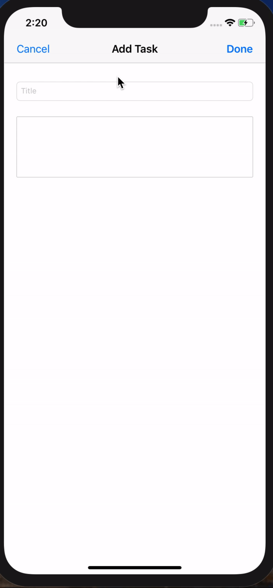
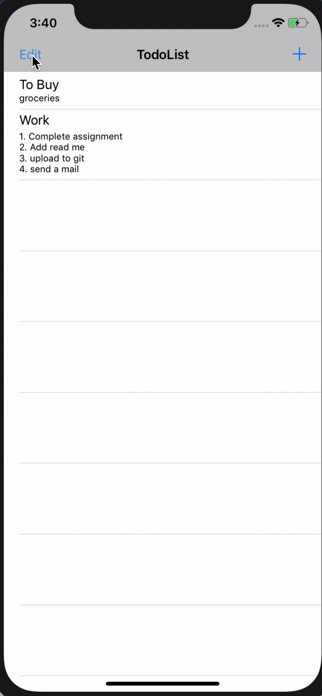
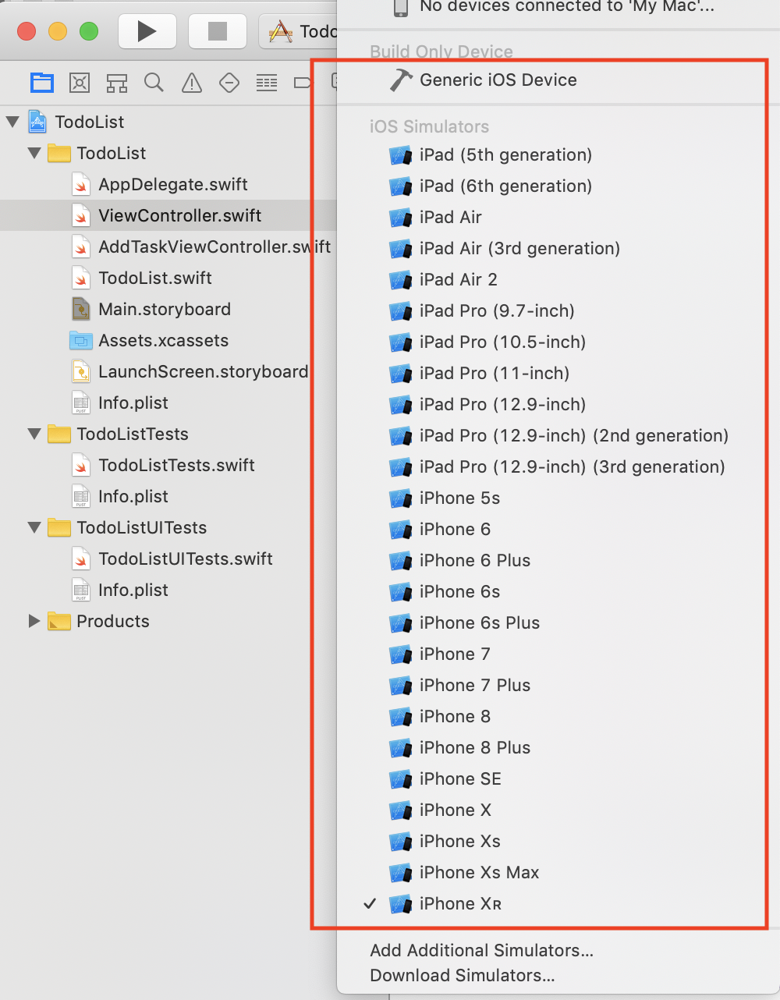
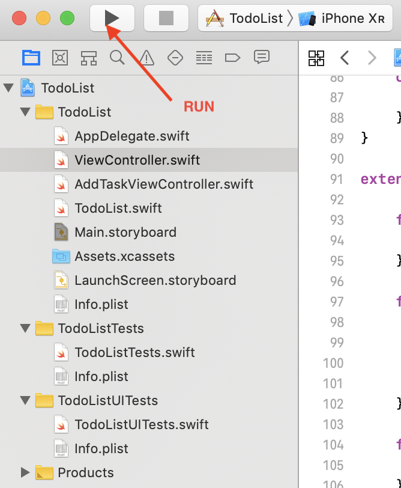
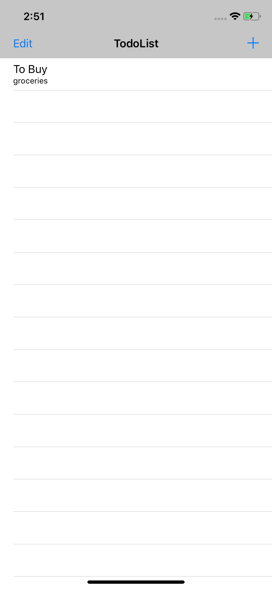
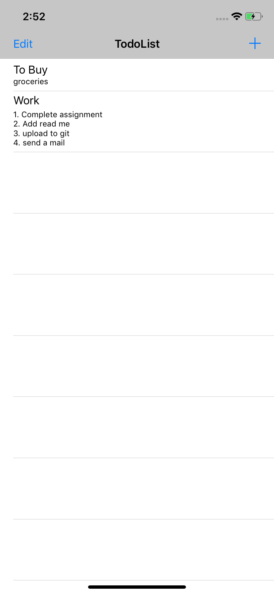
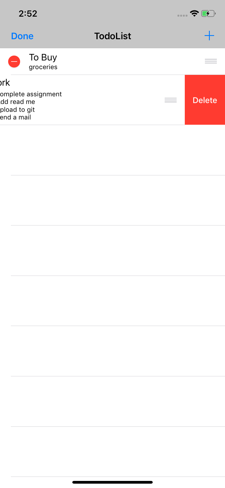
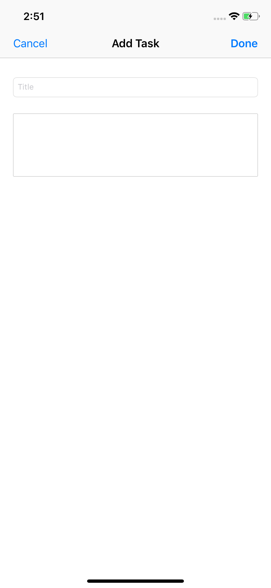

# To-do List
> App to save Todo list.

[![Swift Version][swift-image]][swift-url]

## Features
- [x] Add Task
- [x] Update Task
- [x] Delete Task
- [x] Reorder Task

## Requirements

- iOS 12.0+
- Xcode 10.2

## Demo

                                                 

## Running the App

1. Open `TodoList.xcodeproj` file in the folder

Select any similator from the list. Click on Run in Xcode (Arrow shown in below image)

                        

# Home Screen

1. Click on `+` to add task
2. `Edit` to delete or move tasks order

    

3. Home screen in editing mode
    a). Tap on ~red circle~ to enable delete
    b). Reorder tasks by dragging ~=~ on right of the task

After editing tap on Done to come back to normal mode.

# Add or Edit Task Screen
1. Title
2. Description

## Meta

[swift-image]:https://img.shields.io/badge/swift-5.0-orange.svg
[swift-url]: https://swift.org/
